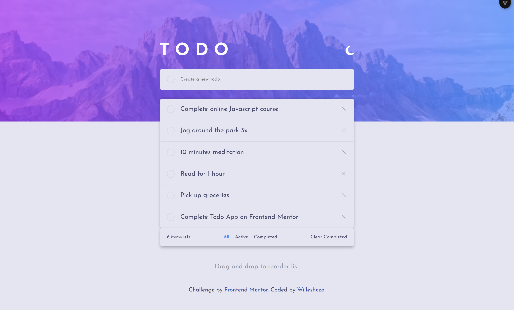
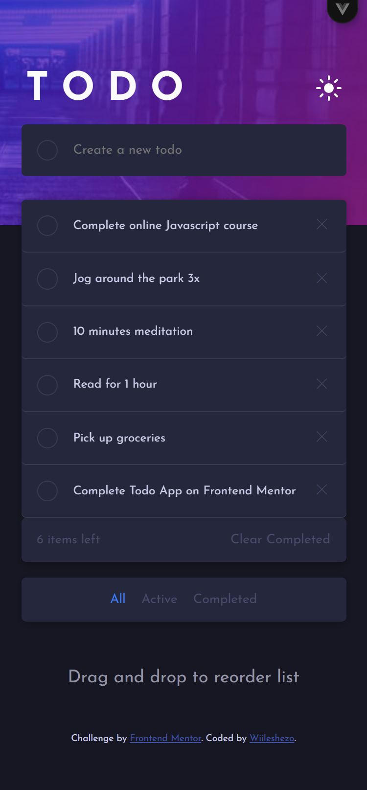

# Frontend Mentor - Todo App Solution

This is a solution to the **Todo App** challenge on Frontend Mentor. The challenge focuses on building an interactive todo application with filtering, drag-and-drop reordering, and responsive design.

---

## 🔗 Live Demo

https://wiileshezo.github.io/todo-app-main/

---

## 📸 Screenshot

Light mode


Dark mode



---

## 🧠 Overview

### The challenge

Users should be able to:

- View the optimal layout for the app depending on their device's screen size
- Add new todos
- Mark todos as completed
- Delete todos
- Filter todos by **All**, **Active**, and **Completed**
- Clear all completed todos
- Drag and drop to reorder items in the list
- See hover states for interactive elements

---

## 🛠️ Built with

- **Vue 3**
- **Pinia** (state management)
- **JavaScript (ES6+)**
- **HTML5**
- **CSS3**
- **Local Storage** (to persist todos)

---

## 🚀 My Process

### Implementation

The application was built using **Vue.js** with a component-based structure. The todo list is managed using Vue's reactive state, allowing the UI to update automatically when tasks are added, removed, or modified.

Key features implemented include:

- Adding new todo items
- Marking items as completed
- Filtering tasks based on their status
- Deleting individual tasks
- Clearing completed tasks
- Drag-and-drop functionality to reorder tasks

### What I learned

During this project, I improved my understanding of:

- Vue reactivity and state management
- Handling user input and events in Vue
- Creating reusable Vue components
- Managing dynamic lists and updating UI efficiently
- Implementing drag-and-drop functionality using JavaScript

---

## 🎯 Continued Development

Future improvements could include:

- Adding animations for task transitions
- Improving accessibility (ARIA roles and keyboard navigation)
- Writing unit tests for todo logic
- Enhancing drag-and-drop performance

---

## ⚙️ Installation & Setup

To run this project locally:

```bash
git clone https://github.com/Wiileshezo/todo-app-main
cd todo-app
npm install
npm run dev
```
